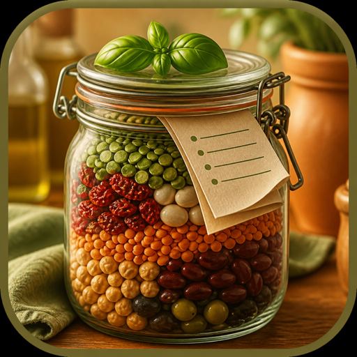
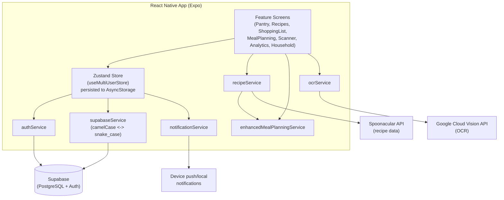

<p align="center">
  
</p>

<h1 align="center">PantryPal</h1>

<p align="center">
  One kitchen. Shared pantry, recipes from what’s left, a list that actually updates.
</p>

<p align="center">
  <a href="https://github.com/rsheth8/PantryPal">Source</a>&nbsp;·&nbsp;<a href="CONTRIBUTING.md">Run locally</a>
</p>

<p align="center">
  
  
</p>

<p align="center"><sub>Spoonacular and Vision are optional — mocks kick in without keys.</sub></p>

---

## What this is

PantryPal is a mobile app (built with React Native and Expo, so it runs on iOS, Android, and web) for people who share a kitchen — roommates, couples, families — and want a shared view of what food they have, what's about to go bad, and what to cook with it.

Each person creates an account and either starts a "household" (which generates a short join code) or joins one someone else created. Once in a household, members can log grocery items either as shared (visible to everyone in the household) or private (visible only to them). The app tracks expiration dates and warns when things are going off, lets people search a recipe database for things they can cook with what's on hand, builds a weekly meal plan around dietary preferences, and keeps a shopping list that can be filled in automatically from recipes that are missing ingredients. A basic scanning screen and OCR receipt-parsing service exist for quickly adding items, and an analytics screen surfaces spending and waste trends. Everything backing this — accounts, households, and data — is stored in a Supabase (PostgreSQL) project.

## Key features

- **Household management** — create/join a household via a 6-character code, shared vs. private item visibility, household member list.
- **Pantry tracking** — grocery items with quantity, unit, category, price, notes, and expiration date; automatic "expiring soon" and "used/expired" flags.
- **Recipe search** — looks up recipes by ingredients on hand via the Spoonacular API, flags which ones are cookable right now and which ingredients are missing; falls back to built-in mock recipes if no API key is configured.
- **Meal planning** — generates a weekly meal plan (breakfast/lunch/dinner/snacks) from available recipes, filtered by dietary preferences (diets, allergens, medical restrictions are treated as non-negotiable; cuisine, difficulty, time, and nutrition targets are relaxed in stages if not enough recipes match).
- **Shopping list** — manual entry plus syncing missing recipe ingredients into the list; shared or private, with a completion toggle.
- **Scanning** — a camera-based scanner screen for barcode/receipt capture, backed by an OCR service (Google Cloud Vision when configured, otherwise a mock parser) that extracts item name/quantity/price/category from receipt text.
- **Notifications** — local push notifications for expiring items, low stock, and household activity (via `expo-notifications`).
- **Analytics** — a dashboard screen for spending and waste-related insights drawn from pantry/shopping data.
- **Dev mode** — a bypass (`isDevMode()`) that skips real authentication and Supabase RLS friction during local development, using a fixed test user.

## How it works

1. **App launch** (`App.tsx`) checks auth status. In dev mode it auto-authenticates with a fixed test user; otherwise it asks Supabase Auth (`authService`) whether a session exists.
2. **Sign in / sign up** (`src/features/auth`) calls `authService`, which wraps `supabase.auth.signInWithPassword` / `signUp` and caches the session in `AsyncStorage`.
3. Once authenticated, `useMultiUserStore.initializeUser()` runs: it loads (or creates) the user's profile row, loads their household (if any) and its members, and pulls the user's pantry items, shopping list, and recipes from Supabase.
4. All screens (`src/features/*`) read from and act on this single Zustand store (`useMultiUserStore`), which is persisted to `AsyncStorage` so state survives app restarts, and is kept in sync with Supabase on every mutation (add/update/delete goes to Supabase first, then updates local state).
5. **Pantry actions** — adding/updating/removing a grocery item writes to the `grocery_items` table via `supabaseService`, updates the store, and schedules local notifications (expiration, low stock) and a household-activity notification if the item is shared.
6. **Recipes** — `RecipesScreen` calls `recipeService`, which queries the Spoonacular API for recipes matching pantry ingredients, converts the API's schema into the app's internal `Recipe` type, and marks which ingredients are missing. Recipes can be saved to Supabase as shared or private.
7. **Meal planning** — `enhancedMealPlanningService` takes the recipe pool and the user's `DietaryPreferences` and tries increasingly relaxed filtering "tiers" (strict → relax non-dietary constraints → dietary-only → minimal/fallback) until it can fill a full week of meals, fetching more recipes from Spoonacular if the local pool is too small.
8. **Shopping list** — items can be added manually or generated from a recipe's missing ingredients (`shoppingListSyncService`), and are stored/synced the same way as pantry items.
9. **Scanning / OCR** — `ScannerScreen` captures a photo (via `expo-camera` / `expo-image-picker`); `ocrService` sends it to Google Cloud Vision for text extraction (or returns mock receipt text if no key is set) and parses the resulting text into candidate grocery items with a category guessed from keyword matching.
10. **Data model** — every entity has a database representation (snake_case, e.g. `grocery_items`, `household_id`) and a frontend representation (camelCase, e.g. `GroceryItem.householdId`); `supabaseService` is the translation layer between the two directions in both reads and writes.



## Tech stack

- **Framework**: React Native 0.79 + Expo SDK 53, TypeScript
- **Navigation**: React Navigation (stack + bottom tabs)
- **State management**: Zustand, persisted via `@react-native-async-storage/async-storage`
- **Backend**: Supabase (PostgreSQL + Auth), accessed via `@supabase/supabase-js`
- **External APIs**: Spoonacular (recipe search/details), Google Cloud Vision (OCR text extraction)
- **Device features**: `expo-camera`, `expo-image-picker`, `expo-notifications`, `expo-auth-session`
- **HTTP**: axios
- **Testing**: Jest + `@testing-library/react-native` (`jest-expo` preset)
- **Tooling**: ESLint (`eslint-config-expo`), Prettier, Husky + lint-staged for pre-commit checks

## Project structure

```
App.tsx                  # App entry: auth check, dev-mode bypass, navigation root
index.ts                 # Expo entry point
FINAL_SQL_SCHEMA.sql      # Supabase/Postgres schema (tables, RLS)
src/
├── components/           # Shared UI: PantryHeader, PantryCard, PantryButton, GradientBackground
├── features/              # One folder per screen/domain area
│   ├── auth/              #   Login / sign-up
│   ├── dashboard/          #   Home dashboard
│   ├── pantry/             #   Pantry list/management
│   ├── recipes/            #   Recipe search and browsing
│   ├── shoppingList/       #   Shopping list
│   ├── scanner/            #   Barcode/receipt scanning
│   ├── mealPlanning/       #   Weekly meal plan generation
│   ├── household/          #   Household create/join/manage
│   ├── analytics/          #   Spending/waste insights
│   └── settings/           #   App settings
├── services/               # Business logic / external API + Supabase access
│   ├── authService.ts
│   ├── supabaseService.ts
│   ├── userService.ts
│   ├── recipeService.ts
│   ├── enhancedMealPlanningService.ts / mealPlanningService.ts
│   ├── shoppingListSyncService.ts
│   ├── ocrService.ts
│   ├── analyticsService.ts
│   └── notificationService.ts
├── store/useMultiUserStore.ts   # Zustand store: the single source of app state
├── navigation/            # AuthNavigator, MainTabNavigator
├── config/                # api.ts, dev.ts, supabase.ts (env/config wiring)
├── types/index.ts          # Shared TypeScript interfaces (User, Household, GroceryItem, Recipe, etc.)
└── utils/                  # designSystem.ts (theme), helpers.ts
```

## Setup / running locally

Requires Node.js and the Expo CLI (invoked via `npx`).

```bash
# 1. Clone and install
git clone <repository-url>
cd PantryPal
npm install

# 2. Configure environment variables
cp .env.example .env
```

Fill in `.env` with:
- `EXPO_PUBLIC_SUPABASE_URL` / `EXPO_PUBLIC_SUPABASE_ANON_KEY` — your Supabase project
- `EXPO_PUBLIC_SPOONACULAR_API_KEY` — recipe data (optional; falls back to mock recipes if unset)
- `EXPO_PUBLIC_GOOGLE_CLOUD_VISION_API_KEY` — OCR scanning (optional; falls back to mock OCR text if unset)

`.env` is gitignored. Variables are read at build time via Expo's `EXPO_PUBLIC_` convention, so restart the dev server after changing them.

```bash
# 3. Set up the database
# Create a Supabase project, then run FINAL_SQL_SCHEMA.sql against it.
# Row Level Security should stay enabled — the anon key is meant to be client-safe under RLS.

# 4. Start the dev server
npx expo start
# press i for iOS simulator, a for Android emulator, w for web, or scan the QR code with Expo Go
```

Other scripts (from `package.json`):

```bash
npm test                 # run Jest tests
npm run test:watch       # watch mode
npm run test:coverage    # coverage report
npm run lint             # ESLint
npm run lint:fix         # ESLint with autofix
npm run format            # Prettier write
npm run format:check      # Prettier check
npm run type-check        # tsc --noEmit
npm run build:check       # lint + format:check + type-check + test
npm run clean              # rm -rf node_modules && npm install
```

## Notable implementation details

- **Dual naming convention**: Supabase tables use snake_case columns (`household_id`, `is_shared`), while the app's internal types use camelCase (`householdId`, `isShared`). `supabaseService.ts` is the single place that converts between the two; some frontend types (e.g. `User`, `Household`) carry both forms during a partial migration.
- **Dev mode bypass**: `src/config/dev.ts`'s `isDevMode()` short-circuits authentication and returns a fixed test user, used throughout `authService`, `supabaseService`, and the store to make local development possible without a fully configured Supabase Auth flow. It also clears the persisted Zustand storage on load so stale dev state doesn't leak between runs.
- **Tiered meal-plan generation**: `enhancedMealPlanningService` treats diets/allergens/medical restrictions as "sacred" (never relaxed) and cuisine/time/nutrition preferences as "flexible" — it retries plan generation across four progressively looser tiers, and will fetch additional recipes from Spoonacular mid-generation if the local pool is too small to fill a week.
- **Graceful API degradation**: both `recipeService` and `ocrService` detect an unconfigured API key (the literal placeholder string, e.g. `'YOUR_SPOONACULAR_API_KEY'`) and transparently fall back to hardcoded mock data, so the app is runnable end-to-end without any third-party keys.
- **Client-side ID generation**: `supabaseService` generates UUIDs and household join codes in JavaScript before inserting rows, rather than relying on database defaults.
- **Local notifications only**: `notificationService` schedules on-device notifications (expiration, low stock, household activity) via `expo-notifications`; there's no server-side push infrastructure.
- **Persisted client state**: the entire app state (pantry, shopping list, recipes, user/household) lives in a single Zustand store persisted to `AsyncStorage`, with Supabase as the source of truth that's re-synced on mutation and on `refreshPantry()`.

## Contributing

PRs and issues welcome. How to run tests, env vars, and the expected layout: [CONTRIBUTING.md](CONTRIBUTING.md).

Don't commit `.env`, API keys, or personal recordings.

